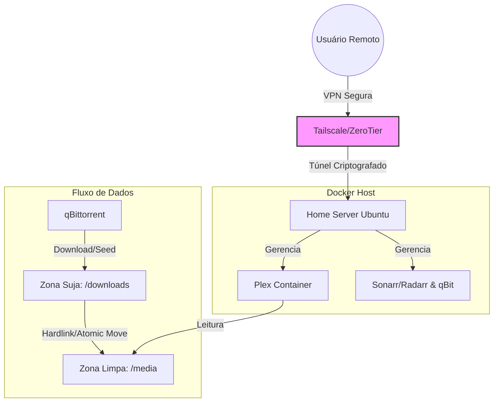

```
# Home Lab Media Server Infrastructure


Repositório contendo a infraestrutura como código (IaC) de um servidor doméstico focado em automação, segurança, eficiência energética e orquestração de contêineres.

## 🏗️ Arquitetura do Sistema



## 📂 Estrutura de Diretórios e Volumes

Para garantir o funcionamento dos **Hardlinks** (evitando duplicação de espaço) e a organização automática, o storage foi estruturado com separação estrita entre áreas de ingestão ("Zona Suja") e biblioteca final ("Zona Limpa"), ambas residindo no mesmo volume físico montado em `/data`.

```text
/mnt/media/  (Raiz do HD Físico mapeado para /data)
├── downloads/          <-- Zona de Ingestão (Seed Ativo)
│   ├── movies/         <-- Categoria: radarr
│   └── tv/             <-- Categoria: tv-sonarr
│
├── movies/             <-- Biblioteca Final Filmes (Hardlinks)
└── tv/                 <-- Biblioteca Final Séries (Hardlinks)

```

## 📚 Documentação Técnica Detalhada

### 1. Pipeline de Automação e Gerenciamento de Categorias

A automação utiliza um sistema de **Categorias do qBittorrent** para roteamento de arquivos:

* **Radarr:** Solicita downloads com a tag `movies` -> qBittorrent salva em `/downloads/movies`.
* **Sonarr:** Solicita downloads com a tag `tv-sonarr` -> qBittorrent salva em `/downloads/tv`.
* **Fluxo Híbrido (Manual + Automático):** Downloads iniciados manualmente no cliente torrent são automaticamente capturados pelo Sonarr/Radarr, desde que a categoria correta seja aplicada. O serviço detecta o arquivo na pasta monitorada e realiza a importação (Hardlink) sem intervenção humana.

### 2. Estratégia de Containerização e Microsserviços

O ambiente foi segregado em duas stacks principais via `docker-compose`:

* **Media Server Stack (Plex):** Isolada para garantir alta disponibilidade na entrega de conteúdo.
* **Management Stack (Arr-Suite):** Responsável pelo ciclo de vida do conteúdo (busca, download, renomeação e organização).

### 3. Otimização de Storage (Atomic Moves)

O sistema utiliza o protocolo de **Hardlinks** do sistema de arquivos `ext4`/`xfs`.

* Quando um download é concluído, o arquivo não é copiado. Um novo ponteiro (inode) é criado na pasta da biblioteca apontando para os mesmos blocos de dados no disco.
* **Resultado:** Ocupação de espaço reduzida em 50% e disponibilidade instantânea (zero I/O de cópia).

### 4. Segurança e Redes (Zero Trust Model)

* **Sem Port Forwarding:** Nenhuma porta (80, 443, 32400) exposta no roteador.
* **VPN Mesh:** Acesso administrativo e streaming realizados exclusivamente via túneis criptografados (Tailscale/ZeroTier), reduzindo a superfície de ataque a zero.
* **Gestão de Segredos:** Credenciais injetadas via `.env` (não versionado).

### 5. Eficiência Energética (Green IT)

Implementação do daemon `hd-idle` para spin-down automático de discos mecânicos USB após 15 minutos de inatividade de I/O, configurado em conjunto com regras de "Pause/Stop Seeding" no cliente torrent para permitir o repouso do hardware.

## 🚀 Como Executar este Projeto

1. **Clone o repositório:**
```bash
git clone https://github.com/klausleme/home-lab-media-player.git
cd home-lab-media-player

```


2. **Prepare a Estrutura de Pastas:**
```bash
# Criar estrutura unificada para permitir Hardlinks
mkdir -p /mnt/media/downloads/{movies,tv}
mkdir -p /mnt/media/{movies,tv}

```


3. **Configure as Variáveis de Ambiente:**
```bash
cp .env.example .env
nano .env
# Ajuste PUID, PGID e caminhos do host dentro do arquivo

```


4. **Inicie as Stacks:**
```bash
docker-compose -f plex/docker-compose.yml up -d
docker-compose -f arr-stack/docker-compose.yml up -d

```

